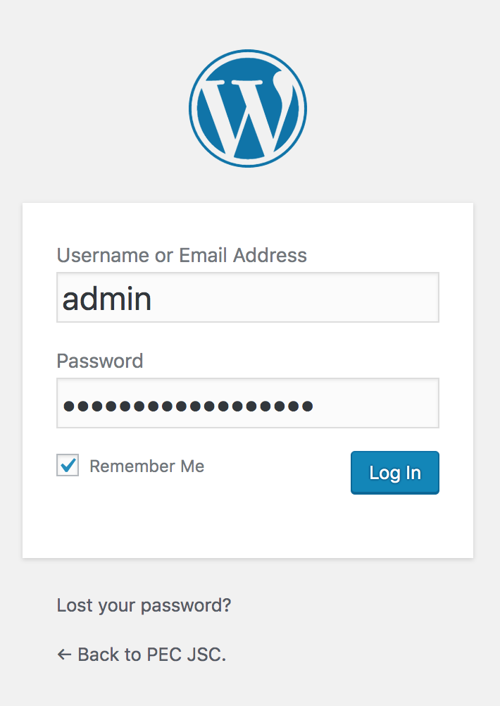
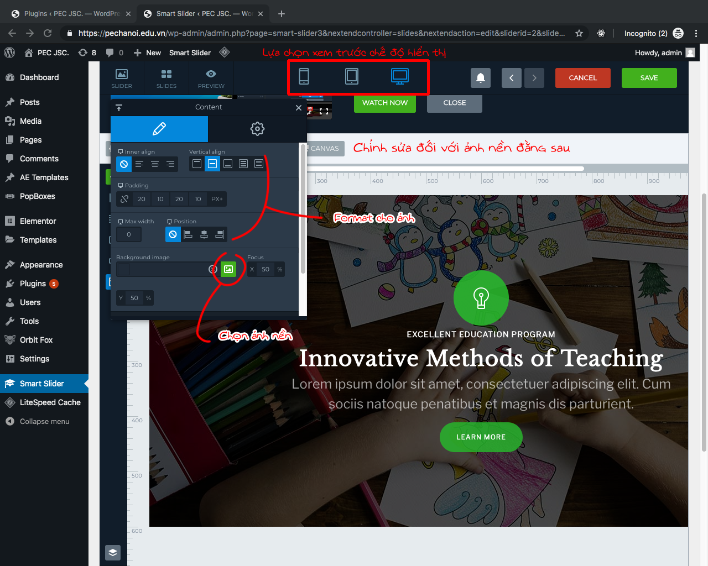

## Lời nói đầu
Tôi viết những dòng này để nhắn nhủ những người đang và sẽ đọc bài này, rằng công nghệ luôn phát triển, nếu một ngày nào đó bạn ngưng tự học, bạn sẽ trở thành người lạc hậu. Tôi biết bạn, người đang đọc bài viết này, có thể không quá thành thạo kiến thức tin học văn phòng, song, tôi mong bạn không phải một người lười nhác. Tất cả những gì tôi sắp hướng dẫn cho bạn sau đây đều cực kỳ đơn giản, đừng bao giờ nghĩ nó khó và cho rằng _"Ôi không, cái này là IT, nó quá cao siêu."_

Hãy luôn tìm tòi, tự trau dồi kiến thức của bản thân mình. Những gì tôi viết dưới đây chỉ cho bạn thấy những thứ sơ đẳng nhất, và không có gì ngoài thực nghiệm cả. Chúc bạn may mắn và đừng quên liên hệ với tôi nếu có gì đó vướng mắc.

## Danh mục thuật ngữ và tài liệu tham khảo
### Thuật ngữ
* Posts - bài viết
* Pages - trang giao diện
* Plugins - phần mở rộng, cài thêm, để hỗ trợ công cụ ban đầu

### Từ viết tắt
* HDSD - hướng dẫn sử dụng
* WP - Wordpress

### Tài liệu tham khảo
* [HDSD nhanh Elementor, cung cấp thông tin nhanh gọn nhất](https://elementor.com/getting-started/)
* [Tài liệu HDSD mọi thành phần của Elementor](https://docs.elementor.com/)
* [Trọn bộ HDSD Smart Slider 3 từ tài liệu giấy tới tài liệu video](https://smartslider3.com/help/)

Và cuối cùng nhưng không kém phần quan trọng, tất nhiên là khi bạn đã quá rành mọi thứ và biết tư duy thuật toán
* [Tài liệu HDSD & customize mọi thành phần trên WP](https://codex.wordpress.org/)

## Mục lục
1. [Giới thiệu](#Giới-thiệu)
2. [Điều kiện tiên quyết](#Điều-kiện-tiên-quyết)
3. [HDSD cơ bản](#HDSD-cơ-bản)
4. [HDSD nâng cao](#HDSD-nâng-cao)

## Giới thiệu
Wordpress là công cụ xây dựng website quảng bá một cách dễ dàng và tiện lợi. Ngoải ra điều khiến Wordpress được chọn làm trình quản trị nội dung chính là nhờ hệ sinh thái phong phú của nó, với một rổ plugin được phát triển và cập nhật liên tục.

Hiện tại website `pechanoi.edu.vn` được xây dựng trên nền tảng Wordpress và plugin chủ đạo là Elementor. Với Elementor, người biên tập website sẽ không phải lo lắng quá nhiều về vấn đề năng lực IT, bởi lẽ mọi tuỳ chỉnh đều được thực hiện bằng phương thức kéo thả trên trang, gần như và rất ít khi phải can thiệp vào mã nguồn trang. Và nếu bạn, người đang đọc bài viết này, không hiểu chút nào về mã nguồn thì tôi khuyên là đừng đụng vào nếu không muốn xảy ra rắc rối.

Lưu ý nho nhỏ là người viết bài này, tức tôi đây, đang sử dụng trình duyệt web là Chrome trên hệ điều hành MacOS nên có thể sẽ có vài phần khác so với những gì bạn hay nhìn thấy trên những trình duyệt web và hệ điều hành khác. Những cái đó rất nhỏ thôi nên đừng bận tâm quá nhiều nhé.

### Thông tin liên hệ

Đây là những thông tin mà bạn nên lưu tâm, để khi có rắc rối thì liên hệ nhanh để được giải đáp

Thông tin liên hệ của tôi:
* nếu có tài khoản slack của trung tâm, hãy gọi tôi trong mục `marketing`
* nếu có tài khoản Skype, hãy tìm `live:sepan223`
* nếu có tài khoản Gmail, hãy mail tới tôi qua `vietan.nguyen2203@gmail.com`

Thông tin liên hệ của phía cho thuê hosting: `https://wpcanban.com/`

Nếu có khúc mắc liên quan tới tôi, hãy soạn theo mẫu sau:

```
1. Nếu là lỗi, mô tả bạn gặp lỗi ở đâu

2. Nếu là chức năng, bạn không hiểu chỗ nào, chỉ ra cách bạn làm và đặt câu hỏi

Khuyến khích đính kèm thêm ảnh để người sửa dễ hiểu ý bạn hơn
```

## Điều kiện tiên quyết
Giới thiệu vậy chắc đủ để bạn làm nóng người rồi đấy nhỉ, giờ thì chuẩn bị nhúng tay vào việc thôi. Tuy nhiên, trước khi cho phép bạn cắm chuột và bàn phím để bắt đầu công việc biên tập viên, tôi cần kiểm tra năng lực của bạn đã. Hãy đảm bảo bạn có ít nhất một trong hai (nếu được cả hai thì **tuyệt vời**) điều kiện sau đây:

1. Đọc hiểu tiếng Anh ở mức phổ thông
2. Biết cách sử dụng máy vi tính và trình duyệt web

Nếu đã đạt được một trong hai điều kiện nêu trên thì xách chuột máy tính lên đi, chúng ta cùng lên đường xây dựng xã hội chủ nghĩa..... à nhầm, xây dựng website nào.

## HDSD cơ bản
Trong HDSD cơ bản, tôi sẽ hướng dẫn bạn cách sử dụng các chức năng thường dùng nhất, đối với các chức năng sử dụng thêm plugin ngoài, tôi sẽ hướng dẫn trong phần nâng cao.

Các chức năng bạn thường dùng và phải quan tâm nhất bao gồm:
1. Đăng nhập
2. Bài viết (Posts)
3. Chỉnh sửa giao diện và nội dung trang (Pages)
4. Chỉnh Appearance

### Đăng nhập
Thêm `wp-admin` vào sau tên miền của bạn để truy cập vào trang quản trị website. Chẳng hạn đối với pechanoi thì tên miền sẽ là [pechanoi.edu.vn/wp-admin](https://pechanoi.edu.vn/wp-admin)


Hãy đợi trình duyệt tải một lúc, sau đó form đăng nhập sẽ hiện ra, bạn điền tên đăng nhập và mật khẩu của mình rồi nhấn nút `Log in`.



**Ghi chú trong hình**: tôi dùng tài khoản admin, nếu bạn dùng tài khoản khác thì hãy xem kĩ tên đăng nhập và mật khẩu của mình nhé. Và tuyệt đối không gửi mật khẩu đi lung tung.

Nếu bạn nhập đúng mật khẩu, trang quản trị sẽ hiện ra như hình dưới. Hãy tập trung vào thanh công cụ phía bên trái.


**Ghi chú**: Nếu bạn muốn backup bài viết thì tôi khuyên sử dụng tính năng backup mà bên hosting cung cấp, nó mạnh mẽ và hiệu quả hơn so với việc backup trên wordpress nói riêng.

### Posts

Trên thanh công cụ, chọn mục `Posts`, sau đó vào phần tìm kiếm để tìm đến _Template Post_ (là một cái template để viết bài mà tôi đã tạo sẵn)


Sau khi clone xong, bạn sẽ được thành quả như này.


Các tuỳ chỉnh trong `Quick Edit` sẽ hiện ra như sau:


Chẳng hạn nếu tôi chọn tiêu đề như trên, thì sau khi chọn mục `All` thì bài viết mới sẽ hiện ra như sau:


Màn hình Edit sẽ hiện lên như sau, kéo xuống tới mục `Featured Image` thì nhấn vào và thêm ảnh vào. Ảnh này sẽ xuất hiện ở trên bài viết khi nó được hiển thị ở danh sách trên trang. Việc thêm ảnh này sẽ khiến bài viết có điểm nhấn hơn khi độc giả liếc qua lần đầu (tức là sẽ có _ảnh - tiêu đề - mô tả ngắn gọn_ thay vì chỉ có _tiêu đề - mô tả ngắn gọn_)


Sau khi đã chọn được một tấm ưng ý làm ảnh đại diện cho post của mình, hãy kéo lên và chọn vào nút `Save Draft` để lưu lại thành phẩm. Rồi sau đó chọn nút `Edit with Elementor` để đi tới giao diện chỉnh sửa post.


Giao diện chỉnh sửa post sẽ có dạng như sau:


**Luu ý**: Chỉ chỉnh sửa những phần mà được bôi đỏ trong hình. Không dây dưa vào phần khác. Để chỉnh sửa thì chỉ cần nhấn vào phần bôi bên phải, những thông tin cần thiết sẽ hiển thị ở cột bên trái, _nên nhấn và chỉnh sửa ở cột bên trái hơn là gõ trực tiếp nội dung lên cột bên phải_

### Pages

Trên menu tay trái, chọn `Pages`, danh sách các pages hiện có sẽ hiện lên như hình. Về việc chỉnh sửa page thì y chang như cách chỉnh sửa post, cũng clone rồi chỉnh lại các nút...


Các page chính (các page tôi được yêu cầu xây dựng, **bạn không nên chỉnh sửa lại layout của chúng nếu không cần thiết**) bao gồm:
* Trang chủ
* Giới thiệu
* Chương trình đào tạo
* Lịch khai giảng
* Thư viện
* Tin tức
* Liên hệ

Các page khác, thường là các page con tôi đã đều bàn giao trong buổi gặp mặt hướng dẫn sử dụng với giám đốc quảng cáo. Nếu bạn có khúc mắc về cách thức tuỳ chỉnh thì hãy liên hệ với tôi qua skype, ta sẽ sắp xếp một buổi hướng dẫn online.

#### Các thành phần hỗ trợ Page

Để page hoạt động trơn tru, thì ta cần có các thành phần hỗ trợ này. Nếu bạn để ý, bạn không thể chỉnh sửa được menu và footer phải không? Để chỉnh lại chúng, bạn phải truy nhập vào `AE Templates` trên menu chính. Chi tiết như hình (các thành phần này đều được tạo ra và chỉnh sửa bằng Elementor nên bạn chỉ cần nắm vững cách sử dụng cơ bản mà tôi đã đính kèm trong phần tài liệu tham khảo là được):


Việc sử dụng template như này sẽ cho phép bạn chỉnh sửa một lần và hiển thị trên mọi trang.

Kế đến là `PopBoxes`, mục này sẽ quản lý mọi popbox hiển thị trên trang, như là cái bạn thấy ở trang chủ mỗi lần mở vào. Chi tiết xem trên ảnh.


Ở mục `Templates`, bạn có thể lưu lại bất cứ template nào mà bạn tạo ra trong quá trình sử dụng Elementor, dù đó là Section hay Page, chi tiết bạn có thể xem trong hướng dẫn của Elementor.

### Appearance

Chọn `Appearance` trên thanh công cụ bên trái, bạn cần quan tâm vào hai phần chính là Themes và Menus. 
  * Đối với Themes, tôi đã chọn Themes hỗ trợ cho Elementor là Astra rồi, bạn không cần thiết phải thay đổi Themes đâu
  * Đối với Menus, hãy làm như hình dưới


Vậy là xong, với từng đó hướng dẫn, bạn đã có thể dùng được hầu hết mọi tính năng của website rồi. Các tính năng sau đây sẽ hướng dẫn bạn nâng cao hơn một chút, nhưng không khó đâu - yên tâm đi, và thường là những tính năng bạn ít khi phải động tay động chân lại nhiều hơn 2 lần.

## HDSD nâng cao
Trong mục HDSD nâng cao này, tôi sẽ hướng dẫn mở rộng thêm cách cài đặt và sử dụng một số Plugin cần thiết cho website của bạn. Những plugin này là những plugin tôi cài trong lúc thực hiện xây dựng. Đối với những Plugin còn lại, bao gồm các plugin do bạn cài đặt thêm hoặc do bên cho thuê hosting cài đặt, vui lòng tham khảo hướng dẫn do nhà cung cấp plugin (thường tìm thấy trong trang chi tiết của nó) và hướng dẫn của phía hosting (cụ thể là của _wpcanban_).

Lưu ý: mỗi khi định cập nhật hoặc thêm mới một plugin nào đó, hãy kiểm tra thật kỹ chi tiết của bên cung cấp plugin để xem nó có thích hợp với website hiện tại không, và có thể tiềm ẩn nguy cơ (xung đột với các plugin hiện tại, lỗ hổng bảo mật, vân vân) hay không. Cẩn tắc vô áy náy.

### Danh sách các Plugin tối thiểu
Mục này đưa ra danh sách các Plugin tối thiểu phải có để bạn có thể sử dụng toàn bộ chức năng của website.

Như đã nói trong phần giới thiệu, khi xây dựng website này, tôi dựa nhiều vào Elementor, nó cho phép bạn có thể kéo thả để xây dựng nhanh gọn mà không phải hiểu quá nhiều về mã nguồn. Bởi vậy, tối thiểu bạn phải có plugin Elementor nếu muốn sử dụng được tính năng đặc biệt này.

Các plugin liên quan đến Elementor bao gồm:
1. Elementor: **bắt buộc phải có**
2. Anywhere Elementor: cho phép đưa các template của elementor đi muôn nơi
3. Essential Addons for Elementor
4. Header, Footer & Blocks for Elementor
5. Image Hover Effects Addon for Elementor
6. NavMenu Addon For Elementor
7. PopBox For Elementor: xây dựng popup (như cái hiện lên ở trang chủ)
8. Press Elements - Widgets for Elementor
9. Void Elementor Post Grid Addon for Elementor Page builder
10. Orbit Fox Companion: thư viện chứa các một số mẫu template có sẵn miễn phí

**Ghi chú**: Nếu bạn không muốn cài cắm cả đống plugin phía trên, thì chỉ cần bỏ tiền ra mua bản quyền Elementor Pro là xong, bạn sẽ không cần phải cài thêm chút nào. Bản quyền hiện tại nếu tôi nhớ không nhầm là $49.99 cho 1 website trong 1 năm, với tất cả các add-on đi kèm của Elementor. Sau một năm hết hạn thì bạn vẫn sẽ được giữ lại đống add-on đó nhưng không được hỗ trợ hay update gì thêm nếu như có lỗi xảy ra. Yên tâm đi, bạn vẫn lãi.

Tiếp đến là các plugin không nằm trong Elementor, các plugin này sẽ hỗ trợ khiến trang của bạn thêm tương tác và bắt mắt hơn (tôi đã cấu hình hết cho bạn rồi, bạn chỉ cần để nguyên đó và sử dụng thôi), bao gồm:
1. Smart Slider 3: khởi tạo, chỉnh sửa và hiển thị các slide trên website của bạn, tôi sẽ hướng dẫn sử dụng nó
2. WP Facebook Messenger: plugin giúp tạo ra hộp thoại chat với Facebook, nhằm giúp kết nối bộ phận hỗ trợ bên fanpage với website của bạn, về hướng dẫn thì bạn có thể tham khảo qua `wpcanban`
3. Duplicate Post: plugin này giúp bạn nhân đôi (clone) bài viết, trang để tăng tốc độ làm việc; thực sự hữu ích đối với mảng bài viết vì ở đó phải dùng Template dành riêng

Ngoài ra còn có một vài plugin khác như là _Really Simple SSL, reSmush.it Image Optimizer, LiteSpeed Cache..._ nhưng đây là các plugin mà bên phía cho thuê hosting cài đặt miễn phí cho bạn. Nếu có vấn đề trục trặc gì thì hãy liên hệ cho họ để khắc phục.

### Hướng dẫn sử dụng Plugin

#### Cách cài đặt và khởi động

Để cài đặt, trước hết bạn nhấn vào `Plugins` trên thanh công cụ bên trái, màn hình hiển thị sẽ như sau:


Như đã nói phía trên, với mỗi plugin cài thêm vào, bạn nên suy xét thật kỹ lưỡng xem nó có gây ảnh hưởng gì tới những thằng ma cũ không, có gây ảnh hưởng gì tới trang không, nếu không thì triển, nếu có thì suy xét hoặc tìm giải pháp khác nhé, đừng cố đấm ăn xôi kẻo đến lúc trang lại bị hỏng thì khó lòng mà dò lỗi lắm.

#### Smart Slider 3

Được rồi đó, giờ đến plugin Smart Slider 3 nào, thực ra thì trong hướng dẫn của NSX cũng đầy đủ lắm rồi, nhưng thôi tôi cứ hướng dẫn qua loa một chút để bạn nắm được phải bắt đầu từ đâu.

Trước hết, chọn `Smart Slider` trên thanh công cụ. Giao diện hiển thị ra sẽ như thế này.


Sau đó chọn tiếp trang slide mà bạn cần chỉnh sửa, nhấn chọn nút `Edit`. Trang slide hiện ra sẽ như thế này.




**Lưu ý**: Như bạn thấy đó, việc chỉnh sửa một slide cũng đơn giản như lúc làm slide trên Powerpoint vậy. Tuy nhiên nếu bạn thấy việc nghĩ tiêu đề và chỉnh sửa các phần vẫn còn quá khó nhằn, thì tôi khuyên là chỉ nên dùng ảnh nền cho mọi slide thôi. Tức là bạn nhờ một designer nào đó, thiết kế cho bạn slide và chỉ cần đổ ảnh nền như ảnh đầu thôi.